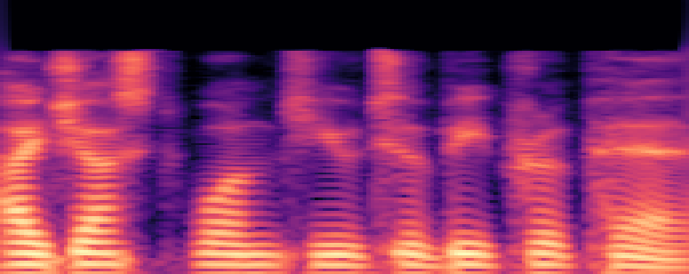
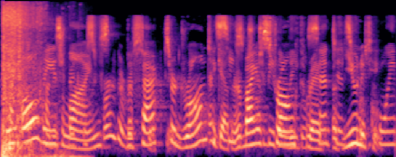
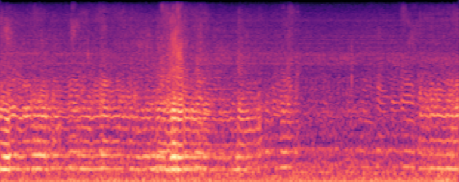
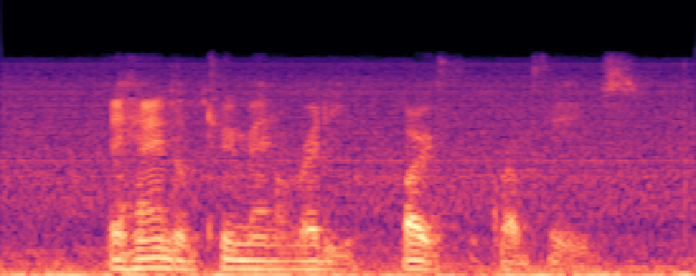
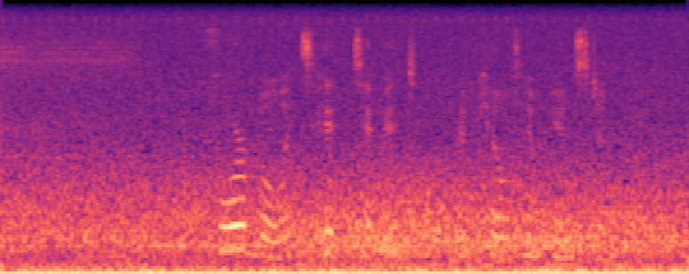
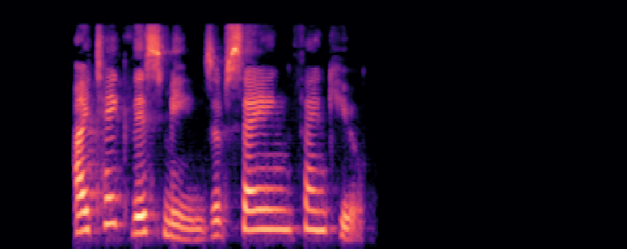
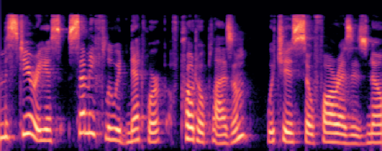
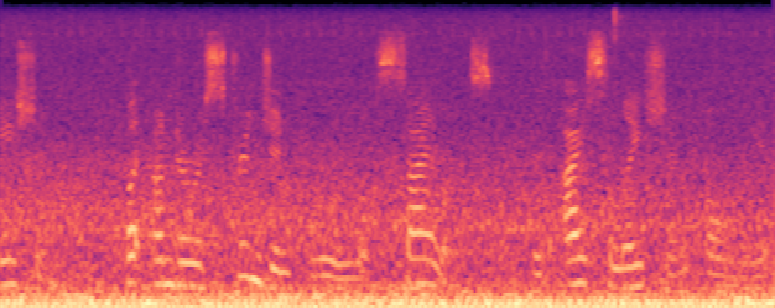

<br>
<br>

# 문제제기
데이터 학습에 있어 주요한 것은 train,test데이터입니다.<br>
현재 나와 있는 모델들은 높은 정확도를 가집니다.<br>
하지만 어쨰선지 test는 똥입니다.<br>
이제부터 그 이유에 대한 고찰을 시작합니다.
<br>
<br>

# 데이터를 보기전 문제보기

- 5초 분량의 입력 오디오 샘플에서 영어 음성의 진짜(Real) 사람의 목소리와 생성 AI의 가짜(Fake) 사람의 목소리를 동시에 검출해내는 AI 모델을 개발해야합니다.
- 학습 데이터는 방음 환경에서 녹음된 진짜(Real) 사람의 목소리 샘플과 방음 환경을 가정한 가짜(Fake) 사람의 목소리로 구성되어 있으며, ***각 샘플 당 사람의 목소리는 1개*** 입니다.
- 평가 데이터는 5초 분량의 다양한 환경에서의 오디오 샘플로 구성되며, **샘플 당 최대 2개의 진짜(Real) 혹은 가짜(Fake) 사람의 목소리가 동시에 존재**합니다.
- **Unlabel 데이터는 학습에 활용할 수 있지만 Label이 제공되지 않으며, 평가 데이터의 환경과 동일합니다.**
<br>
<br>
<br>
<br>

# 문제의 분석
## 학습 데이터와 평가 데이터의 간극

### 1. 종류의 차이
**학습데이터는 많아야 하나이지만 평가는 오직 1개라고 한적이 없습니다.**

```
학습 데이터 : 각 샘플 당 사람의 목소리는 1개
평가 데이터 : 샘플 당 최대 2개의 진짜(Real) 혹은 가짜(Fake) 사람의 목소리가 동시에 존재
```


### 2. 시각화 비교
아래의 데이터는 훈련 및 테스트 데이터의 *특징추출을 시각화* 한 사진입니다.<br>
두 데이터는 누가 보아도 특징이 다릅니다. 여기까진 그냥 이것만 있는 줄 알았습니다.
- 훈련데이터 샘플 AAACWKPZ<br>

- 테스트데이터 샘플 TEST_00000<br>


### 3. 소음데이터
데이터를 보면 이상한 점이 많았습니다. 자주 등장하기도 한 이상한 점. 소음데이터(가칭) 입니다.<br>
아래 데이터가 바로 그 대표적인 예시입니다.
- 사진 TEST_00021<br>


- 음성 TEST_00021<br>
[TEST_00021.ogg](TEST_00021.ogg).
<br>

이것이 문제란 것은 아닙니다. 다만, 확연히 다른 모습이라는 것이죠
### 4. 학습당시의 잡음
아래의 소리를 들어보시면 잡음이 있음을 알게 됩니다. 물론 소리가 있기에 뭐 그렇게 나쁘지만은 않습니다.
- 사진 AHJQEQQY<br>

- 음성 AHJQEQQY<br>
[AHJQEQQY.ogg](AHJQEQQY.oggg).

### 5. unlabel의 분석
문제에는 **Unlabel 데이터는 학습에 활용할 수 있지만 Label이 제공되지 않으며, 평가 데이터의 환경과 동일합니다.** 라는 문구가 있습니다.
그래서 스펙트럼을 뽑아보았습니다.
<br>
확연히 다릅니다. 이 데이터는 테스트랑 닮음을 알 수 있습니다. 좀 좋은 것은 학습을 할 수 있는점이 있고, 이는 이점을 줄 수 있기도 합니다.
<br>
어떻게 쓸지는 마음대로 입니다.
- 사진 BCFCIBHG<br>

- 사진 ADUNDKGO<br>

- 사진 BELZRKJI<br>

- 사진 CKDVTZGL<br>
